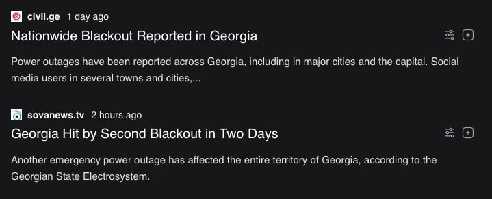
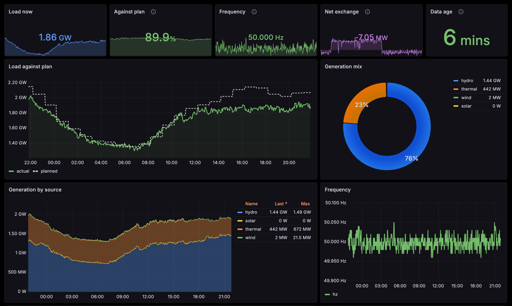

# gse-exporter

georgian power grid, as prometheus metrics

scraped off [Georgian State Electrosystem](https://www.gse.com.ge) (საქართველოს სახელმწიფო ელექტროსისტემა), the national grid operator.

<p align="center">
  
  
</p>

<p align="center"><sub>two nationwide blackouts in two days, the root cause is on the right (unconfirmed)</sub></p>

## run it

```sh
docker run -p 9821:9821 ghcr.io/jsopn/gse-exporter:1.0.0
curl localhost:9821/metrics
```

## metrics

| | |
|---|---|
| `gse_consumption_watts` | country wide load rn |
| `gse_consumption_estimate_watts` | the load gse planned, hourly steps |
| `gse_frequency_hertz` | 50 is happy |
| `gse_generation_watts{source}` | hydro / thermal / wind / solar |
| `gse_import_watts` `gse_export_watts` | |
| `gse_interconnection_flow_watts{country,link}` | per border tie, signed, + is into georgia |
| `gse_data_timestamp_seconds` | newest upstream sample, alert on its age |
| `gse_up` | last poll ok |

## grafana

import [dashboards/gse-exporter.json](dashboards/gse-exporter.json) and pick your prometheus datasource

<p align="center">
  
</p>

## helm

```sh
helm install gse ./charts/gse-exporter \
  --set serviceMonitor.enabled=true \
  --set prometheusRule.enabled=true
```

| | |
|---|---|
| `serviceMonitor.enabled` | scraping |
| `prometheusRule.enabled` | alerts |
| `scrapeAnnotations.enabled` | plain `prometheus.io/*`, if u run no operator |

see more in [values.yaml](charts/gse-exporter/values.yaml)

alerts u get:

- `GSEConsumptionCollapse` load fell off a cliff vs 15m ago
- `GSEConsumptionBelowPlan` under a third of plan for 15m, holds for the whole outage
- `GSEFrequencyDeviation`, `GSEDataStale`, `GSEExporterDown`